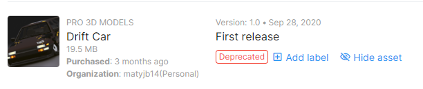

Tireslide

Assets:
 - [dźwięk opon](https://randyol.home.xs4all.nl/wavgeluiden/wav_geluiden.htm)
 - [dźwięk startu/odliczania](https://freesound.org/people/JustInvoke/sounds/446142/)
 - 
 - [dźwięk silnika](https://assetstore.unity.com/packages/audio/sound-fx/transportation/rotary-x8-free-engine-sound-pack-106119)
 - [wykonanie elementów generatora przy pomocy bezier path creator](https://assetstore.unity.com/packages/tools/utilities/b-zier-path-creator-136082)
 - [dźwięk kostek](https://freesound.org/people/AxelSpeller/sounds/369746/)
 - [dźwięk barmki x2 oraz bonus](https://freesound.org/people/Tetoszka/sounds/541499/)
 - [dźwięk uderzenia w ściane](https://freesound.org/people/thecoolcookie17/sounds/573047/)
 - [dźwięk zdobycia pkt za drift/skok](https://freesound.org/people/qubodup/sounds/60013/)
 - [dźwięk podczas zdobywania pkt za drift/skok](https://freesound.org/people/Joao_Janz/sounds/482653/)
 - [dźwięk guzików menu](https://freesound.org/people/suntemple/sounds/253172/)
 - [skrypt śladów opon](https://github.com/Nition/UnitySkidmarks)
 - [konfetti1](https://freesound.org/people/Breviceps/sounds/458398/) + [konfetti2](https://freesound.org/people/themfish/sounds/45825/)

[Dlaczego TextMeshPro jest w repozytorium i nie jest ignorowane](https://github.com/game-ci/unity-actions/issues/62)
