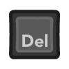
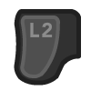
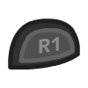

# Tireslide
1. [Opis](#Opis)
2. [Założenia gry](#Założenia-gry)
3. [Główne mechaniki](#Główne-mechaniki)
    - [Generator tras](#Generator-tras)
    - [System punktowy](#System-punktowy)
4. [Sterowanie](#Sterowanie)
    - [Klawiatura](#Klawiatura)
    - [Gamepad](#Gamepad-(PS/XBOX))
5. [Użyte assety](#Użyte-assety)

## Opis
Gatunek: wyścigowa

Gracz ma za zadanie zdobyć jak największą ilość punktów w wyznaczonym czasie na generowanych losowo trasach. Przy pomocy samochodu do driftu zdobywa punkty poprzez wykonywanie poślizgów lub przejeżdżanie przez bramki lub zderzanie się z obiektami za które można zdobyć premie punktową. 

## Założenia gry
Za wykonywane poślizgi są zdobywane punkty. Na ilość punktów zdobytych wpływa kąt poślizgu oraz prędkość. Jeśli gracz zderzy się ze ścianą punkty za poślizg są anulowane. Zdobywane są tylko jeśli pomyślnie zakończy poślizg. 

Na trasie można napotkać premie punktowe w postaci bramek oraz czerwonych pudełek. Za przejazd przez bramkę lub zderzenie się z pudełkami gracz jest nagradzany natychmiastowo punktami. 

Gracz musi ukończyć trasę w wyznaczonym limicie czasowym. Jeśli limit czasu upłynie od wyniku punktów są odejmowane punkty wraz z upływem czasu. Także gracz nie może zdobywać dodatkowych punktów. 

Istnieje mnożnik punktów, który można zwiększyć przejeżdżając przez bramkę mnożnika. Mnożnik zostaje zwiększony o 1 na 10 sekund. Wszystkie punkty, które są zdobywane przez gracza są mnożone przez aktualny mnożnik. Po upływie czasu gry mnożnik wynosi 0 co skutkuje brakiem możliwości zdobywaniem punktów tak jak to było wspomniane wyżej. 

## Główne mechaniki
### Generator tras
Generator generuje trase z dostępnych obecnie 8 elementów drogi.

Każdy z elementów jest wymodelowany na podstawie krzywej Béziera. Na końcach tej krzywej znajdują się łączniki choć ich pozycja nie jest uzależniona od tego. Łączniki mogą znajdować się w dowolnym miejscu i w dowolnej ilości. W tym przypadku dla 8 podstawowych elementów każdy z nich ma po dwa łączniki na końcach krzywych Béziera o odpowiednich typach. 

Łączniki - służą do łączenia elementów ze sobą. Łącznik ma typ (obecnie są to dwa typy: RoadNarrow oraz RoadWide). Generator podczas dobierania kolejnego elementu trasy bierze pod uwagę elementy tylko te, które posiadają łącznik o tym samym typie co łącznik elementu poprzednio wybranego. Zapewnia to, że elementy po wygenerowaniu będą tworzyć trasę, której elementy są dopasowane. 

Ponieważ, że generowanie oraz dobieranie elementów są losowe to może zdarzyć się sytuacja, że jakiś dobrany element może nałożyć się na wcześniej wygenerowany inny element. Taki efekt jest niepożądany, bo może to tworzyć przenikające się tekstury oraz błędy typu `z-fighting`. 

Jest to rozwiązane dodanie do każdego elementu BoxCollider'a, który następnie jest sprawdzany czy nie nakłada się z innymi elementami. Jeśli się nakłada algorytm próbuje ustawić element inaczej używając innego łącznika elementu (o ile takie są), jeśli nadal występuje taka sytuacja dobierany jest inny element. Jeśli nie ma innych możliwych elementów algorytm wraca.
### System punktowy
Gracz może zdobywać punkty na kilka sposobów:
- za przejeżdzanie przez brami
- za przejeżdzanie przez pudełka
- za drift

#### Bramki
W grze są obecne dwa typy bramek:
- zwykła bramka bonusowa - nagroda 15 punktów

- bramka mnożnika punktów - nagroda: zwiększa mnożnik punktów o 1 na 10 sekund

#### Pudełka
Nagroda to 30 punktów.

## Sterowanie
### Klawiatura
- / - przyspieszenie
- i/i - kierowanie
- / - hamulec/wsteczny
- / - hamulec ręczny
-  - restart
-  - pauza

### Gamepad (PS/XBOX)
- / - przyspieszenie
- / - kierowanie
- / - hamulec/wsteczny
- / - hamulec ręczny
- / - restart
- / - pauza

## Co może być dodane
 - Tabele wyników graczy dla każdej z tras
 - Personalizacja wyglądu samochodu, zarówno malowanie jak i model
 - Edytor tras
 - Więcej elementów do generatora tras (skoki, rampy, droga z dziurami etc.)
 - Więcej obiektów do generacji na trasie (inne pudełka, bramki, strefy driftu etc)

## Użyte assety
 - [dźwięk opon](https://randyol.home.xs4all.nl/wavgeluiden/wav_geluiden.htm)
 - [dźwięk startu/odliczania](https://freesound.org/people/JustInvoke/sounds/446142/)
 - 
 - [dźwięk silnika](https://assetstore.unity.com/packages/audio/sound-fx/transportation/rotary-x8-free-engine-sound-pack-106119)
 - [wykonanie elementów generatora przy pomocy bezier path creator](https://assetstore.unity.com/packages/tools/utilities/b-zier-path-creator-136082)
 - [dźwięk kostek](https://freesound.org/people/AxelSpeller/sounds/369746/)
 - [dźwięk barmki x2 oraz bonus](https://freesound.org/people/Tetoszka/sounds/541499/)
 - [dźwięk uderzenia w ściane](https://freesound.org/people/thecoolcookie17/sounds/573047/)
 - [dźwięk zdobycia pkt za drift/skok](https://freesound.org/people/qubodup/sounds/60013/)
 - [dźwięk podczas zdobywania pkt za drift/skok](https://freesound.org/people/Joao_Janz/sounds/482653/)
 - [dźwięk guzików menu](https://freesound.org/people/suntemple/sounds/253172/)
 - [skrypt śladów opon](https://github.com/Nition/UnitySkidmarks)
 - [konfetti1](https://freesound.org/people/Breviceps/sounds/458398/) + [konfetti2](https://freesound.org/people/themfish/sounds/45825/)

[Dlaczego TextMeshPro jest w repozytorium i nie jest ignorowane](https://github.com/game-ci/unity-actions/issues/62)
